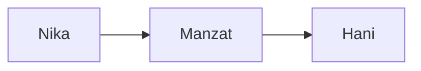

# استانداردهای نگارش

> این سند، قواعد نگارش و مستندسازی تمام اسناد پروژه «The Earth Will Hear Story Bible» را تعیین می‌کند. رعایت این استانداردها برای همه فایل‌های پروژه الزامی است.

---

# 1. هدف

هدف این سند ایجاد یک سبک نگارش یکنواخت، دقیق و قابل استناد در سراسر پروژه است.

این استاندارد تضمین می‌کند که:

- همه اسناد ساختار یکسانی داشته باشند.
- اطلاعات به‌صورت سازگار ثبت شوند.
- خوانایی و قابلیت جستجو افزایش یابد.
- توسعه پروژه در سال‌های آینده بدون آشفتگی امکان‌پذیر باشد.

---

# 2. اصول کلی

## 2.1 مرجع اصلی

تنها مرجع Canon پروژه، متن رسمی رمان است.

دانشنامه وظیفه تفسیر یا تغییر داستان را ندارد.

---

## 2.2 دقت

تمام اطلاعات باید دقیق باشند.

از واژه‌هایی مانند:

- احتمالاً
- شاید
- به نظر می‌رسد

در بخش Canon استفاده نمی‌شود.

---

## 2.3 تفکیک واقعیت و تحلیل

تمام مطالب باید در یکی از سه گروه زیر قرار بگیرند.

### Canon

اطلاعات استخراج‌شده از متن رمان.

---

### Analysis

تحلیل نویسنده دانشنامه.

---

### Production Note

یادداشت‌های مربوط به فیلم، تصویرسازی، بازی یا هوش مصنوعی.

---

# 3. لحن نگارش

تمام اسناد باید دارای ویژگی‌های زیر باشند.

- رسمی
- دقیق
- مستند
- بی‌طرف
- روشن
- بدون اغراق
- بدون قضاوت ارزشی

---

# 4. زمان افعال

در اسناد دانشنامه از زمان حال استفاده می‌شود.

درست

> نیکا در کُهباد زندگی می‌کند.

نادرست

> نیکا در کُهباد زندگی می‌کرد.

---

# 5. زبان

متن اسناد به زبان فارسی نوشته می‌شود.

نام فایل‌ها، شناسه‌ها و کلیدهای فنی به زبان انگلیسی هستند.

---

# 6. نقل‌قول

تمام نقل‌قول‌ها باید دقیقاً مطابق متن رمان باشند.

اصلاح ادبی یا تغییر واژگان مجاز نیست.

در صورت حذف بخشی از نقل‌قول از علامت «...» استفاده می‌شود.

---

# 7. نام شخصیت‌ها

در اولین اشاره:

**نیکا (Nika)**

پس از آن:

**نیکا**

---

# 8. نام مکان‌ها

نام مکان‌ها مطابق نگارش رسمی رمان نوشته می‌شوند.

مثال:

- کُهباد
- کول‌فرح
- آیاپیر
- شوش

---

# 9. واژه‌های تاریخی

واژه‌های بومی یا تاریخی تغییر داده نمی‌شوند.

نمونه:

- خیگ
- تاکو
- ورزا
- طومار

در صورت نیاز، توضیح آن‌ها در واژه‌نامه ثبت می‌شود.

---

# 10. اعداد

در متن فارسی از ارقام فارسی استفاده می‌شود.

مثال:

درست

```
۳ خانواده
```

نادرست

```
3 خانواده
```

در شناسه‌ها و فایل‌ها از ارقام لاتین استفاده می‌شود.

---

# 11. تاریخ

تاریخ‌های داخل داستان مطابق نظام زمانی جهان داستان نوشته می‌شوند.

تاریخ‌های مربوط به پروژه از استاندارد ISO 8601 استفاده می‌کنند.

نمونه:

```
2026-07-13
```

---

# 12. ساختار اسناد

هر فایل باید شامل بخش‌های زیر باشد.

۱. Front Matter

۲. عنوان

۳. مقدمه

۴. متن اصلی

۵. ارجاعات

۶. تاریخچه نسخه‌ها

---

# 13. Front Matter

نمونه

```yaml
---
id:
title:
title_fa:
version:
status:
---
```

---

# 14. استفاده از Markdown

فقط از امکانات استاندارد Markdown استفاده می‌شود.

- Heading
- Table
- List
- Blockquote
- Code Block
- Horizontal Rule

از HTML تا حد امکان استفاده نمی‌شود.

---

# 15. پیوندهای داخلی

برای ارجاع داخلی از ویکی‌لینک استفاده می‌شود.

نمونه

```
[[CHR-001-Nika]]

[[LOC-001-Kohbad]]

[[EV-003-Tax-Increase]]
```

---

# 16. تصاویر

هر تصویر باید دارای:

- شناسه
- عنوان
- توضیح
- منبع
- وضعیت Canon

باشد.

---

# 17. نمودارها

نمودارها تا حد امکان با Mermaid نوشته می‌شوند.

نمونه



---

# 18. جدول‌ها

جدول‌ها باید ساده و قابل تبدیل به HTML باشند.

از ادغام سلول‌ها استفاده نمی‌شود.

---

# 19. اصطلاحات انگلیسی

اصطلاحات تخصصی در اولین استفاده همراه با معادل انگلیسی نوشته می‌شوند.

مثال

پیوستگی (Continuity)

---

# 20. اختصارات

هر اختصار باید یک بار به‌طور کامل معرفی شود.

---

# 21. ممنوعیت‌ها

در اسناد پروژه موارد زیر مجاز نیستند.

- شوخی
- زبان محاوره
- ایموجی
- حدس شخصی
- اطلاعات بدون منبع
- اغراق

---

# 22. سازگاری

تمام اسناد باید بدون تغییر در ابزارهای زیر نمایش داده شوند.

- GitHub
- GitLab
- Obsidian
- VS Code
- MkDocs
- Docusaurus

---

# 23. بازنگری

در صورت تغییر این استاندارد:

- نسخه افزایش می‌یابد.
- تغییر در CHANGELOG ثبت می‌شود.
- اسناد وابسته در صورت نیاز اصلاح می‌شوند.

---

# 24. اصل نهایی

هر سند باید به گونه‌ای نوشته شود که یک پژوهشگر، مترجم، فیلم‌نامه‌نویس یا سامانه هوش مصنوعی بتواند بدون مراجعه مستقیم به رمان، اطلاعات آن را به‌درستی درک و استفاده کند.

---

## تاریخچه نسخه‌ها

| نسخه | تاریخ | توضیح |
|-------|--------|--------|
| 1.0.0 | YYYY-MM-DD | انتشار نخست |

---

**وضعیت سند:** Canon

**پایان سند**